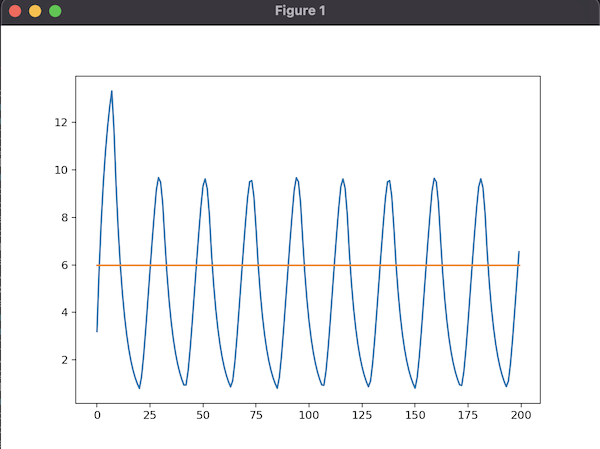

# homeostasis-simulation

Simulation of the cell regulatory mechanisms with negative feedback loops, using discrete-event simulation techniques. The code is a playground for the concept initially proposed in [System to simulate the activity of living organism - construction of proteome](https://www.sciencedirect.com/science/article/abs/pii/S1877750320304968).



## Scripts

- `make install` - create virtual env and install dependencies
- `source .venv/bin/activate` - activate virtual env
- `deactivate` - deactivate virtual env
- `make test` - run tests
- `make lint` - run linter
- `make clean` - clean

## Usage

```python
import matplotlib.pyplot as plt
from matplotlib.pyplot import figure
from control import ControlUnit

# control units
unit = ControlUnit(
    initial_value=0,
    outflow_rate=0.2,
    delay=8,
    molecular_activity=4,
    threshold=6)

# simulation
simulation_time = 200
threshold_values = [unit.threshold] * simulation_time
results = list(map(lambda _: unit.perform_step(), range(simulation_time)))

# results
figure(figsize=(16, 9), dpi=80)
plt.plot(results)
plt.plot(threshold_values)
plt.show()
```
