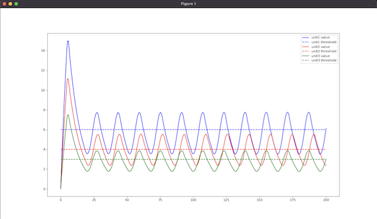
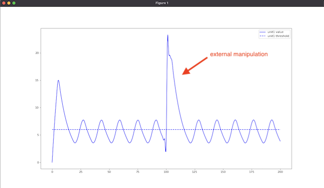

# homeostasis-simulation

Simulation of the cell regulatory mechanisms with negative feedback loops, using discrete-event simulation techniques. The code is a playground for the concept initially proposed in [System to simulate the activity of living organism - construction of proteome](https://www.sciencedirect.com/science/article/abs/pii/S1877750320304968).





## Scripts

- `make install` - create virtual env and install dependencies
- `source .venv/bin/activate` - activate virtual env
- `deactivate` - deactivate virtual env
- `make test` - run tests
- `make lint` - run linter
- `make clean` - clean

## Usage

```python
from effector import Effector
from model import Model
from product import InifiniteSubstrate, ProductState
from receptor import DelayedReceptor

# states
state1 = ProductState(initial_value=0, outflow_rate=0.1)
state2 = ProductState(...)
state3 = ProductState(...)

# units
effector1 = Effector(
    id='unit1',
    state=state1,
    substrate=InifiniteSubstrate(1000),
    receptor=DelayedReceptor(delay=5, threshold=6, state=state1),
    molecular_activity=4,
)

effector2 = Effector(...)

effector3 = Effector(...)

# simulation
model = Model(effectors=[effector1, effector2, effector3])
simulation_time = 200

for _ in range(simulation_time):
    model.perform_step()

# results
model.plot_results(['b', 'r', 'g'])
```
